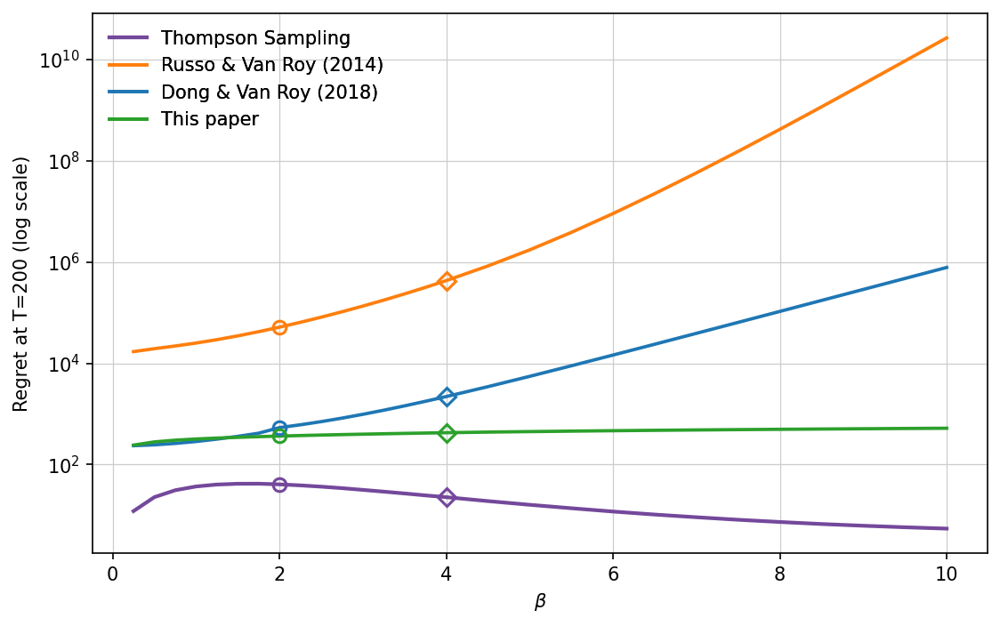
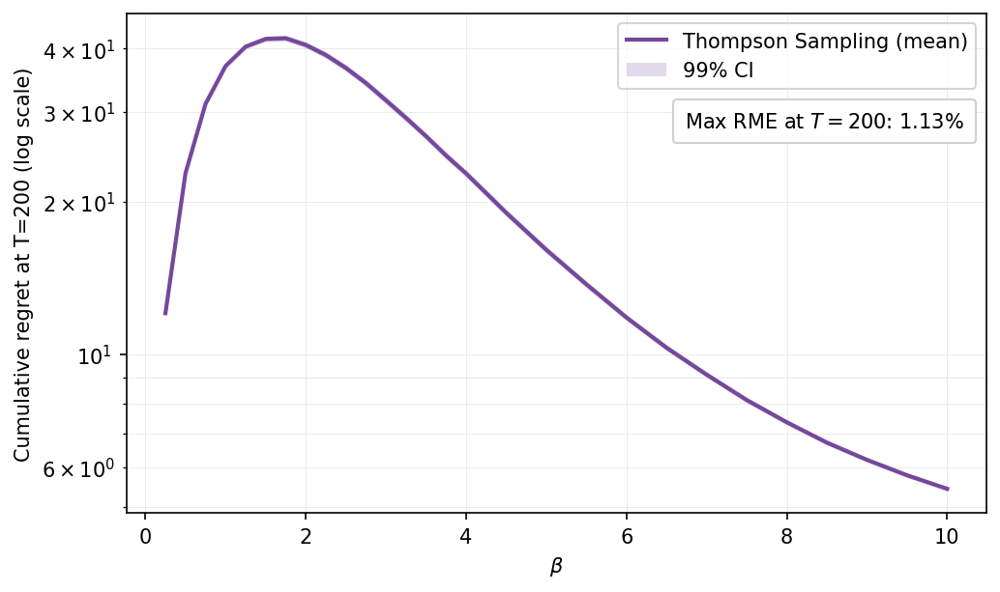

# Thompson Sampling for Logistic Bandits

This repo contains an of Thompson Sampling for **logistic bandits** where both the action set and parameter set are the unit sphere $S^{d-1}$. Posterior sampling is done with Metropolis–Hastings (MH) random walks on the sphere using von Mises–Fisher. We consider a synthetic logistic bandit with dimension $d=10$, horizon $T=200$, and logistic slope parameter $\beta\in[0.25,10]$. The action and parameter spaces are both the unit sphere, and the prior on $\Theta$ is uniform.

We use this implementation to compare our new regret bound against prior bounds (Dong & Van Roy, 2019; Russo & Van Roy, 2014).

---

### Regret vs time with bounds ($\beta \in \{2,4\}$)
Left plot: empirical cumulative regret (mean over runs) and two bounds.  
Right plot: cumulative regret at $T=200$ vs $\beta$ with the same bounds.

<p align="center">
  
  
</p>

**Commentary:**  
The **left plot** shows the evolution of regret and two regret bounds for $\beta\in\{2,4\}$. Our bound is consistently tighter over the entire horizon and is less sensitive to increases in $\beta$. The **right plot** shows cumulative regret at $T = 200$ and as $\beta$ varies; our bound remains competitive across the full range and quickly becomes orders of magnitude smaller than alternatives for moderate/large $\beta$. In contrast, the compared bounds grow rapidly with and can become vacuous.

> Note: the 95% confidence intervals are very tight and not visually apparent on the bounded plots above. For completeness, we include CI versions:

<p align="center">
  
  
</p>

We produce tikZ exports (`.tex`) for all figures. They can be found in the same `figures/` folder.

---

## Folder structure

```
logistic-bandits/
├── logistic_bandits_ts.py     # Main experiment runner (batched MH TS) and helpers
├── mh_sphere.py               # vMF proposals on the sphere + batched MH kernel
├── plots_ts.py                # Plotting utilities (PNG + TikZ), bounds, CI, helper runners
├── results_experiments/       # Saved tensors: per-run and averaged regrets
│   ├── logistic_ts_all_beta_<β>_d_<d>.pt         # shape: (num_runs, T)
│   └── logistic_ts_avg_beta_<β>_d_<d>.pt         # shape: (T,)
├── figures/                   # Rendered figures (.png) and TikZ (.tex)
├── requirements.txt           # Python dependencies
└── .venv/                     # (optional) local virtual environment
```

### What the core files do
- **`logistic_bandits_ts.py`**  
  Runs **Thompson Sampling** with the logistic likelihood. The results are saved in two files:
  - Per-run per-time regrets: `results_experiments/logistic_ts_all_beta_<β>_d_<d>.pt` (tensor (N,T)).
  - The average (mean over runs): `..._avg_...pt` (tensor (T,)).
- **`plots_ts.py`**  
  Loads saved results and produces the four figures above. It also exports TikZ via `matplot2tikz`.
- **`mh_sphere.py`**  
  Implements **MH on the sphere** with **vMF** random-walk proposals. We operate on shape $(B,K,d)$: $B$ experiments in parallel, each with $K$ chains, in $d$ dimensions. The proposal is
  $$
  \theta' \sim \mathrm{vMF}(\mu=\theta,\ \kappa),
  $$
  and we accept with $\min\{1, \exp(\log p(\theta') - \log p(\theta))\}$. The code runs entirely on CUDA when available.


---

## Installation

We recommend a virtual environment:

```bash
python3 -m venv .venv
source .venv/bin/activate
pip install --upgrade pip
pip install -r requirements.txt
```

**CUDA:** If you’re on a GPU pod (e.g., `runpod/pytorch:2.8.0-py3.11-cuda12.8.1`). All samplers and math run on GPU if available.

### Requirements

```
numpy
torch
tqdm
matplotlib
scipy
```

For **TikZ** figure export (versions that we found to work together):
```
matplot2tikz
matplotlib==3.7.5
webcolors==1.13
```

> If you only need PNGs, you can skip `matplotlib` and `webcolors`.

---

## Reproducing the results

#### Run the sweep to generate results

This will run $N$ experiments per $\beta$, in batches, and save tensors under `results_experiments/`.

```bash
python - <<'PY'
from logistic_bandits_ts import sweep_betas

sweep_betas(
    betas=np.r_[0.25:4.0+0.25:0.25,  4.5:10.0+0.5:0.5].tolist(),
    d=10, T=200,
    num_exp=120,           # number of independent runs per beta
    batch_size=12,         # how many runs in parallel on GPU
    chains=192,            # MH chains per run
    mh_steps=10,           # MH steps per time round
    append=True,           # append new runs if files already exist
    progress=True,
)
PY
```

This can also be achieved by running ```python logistic_bandits_ts.py```. 


#### Make all the figures

This command produces the two figures (regret vs time for $\beta =2$ and $\beta = 4$, regret vs $\beta$ at $T=200$) in two versions: without bounds but with confidence interval, and with bounds and without confidence intervals. The figures are saved under `figures/` both as a `.png` and a `.tex` file.

```bash
python plots_ts.py
```


---

## References

- **Russo & Van Roy (2014).** [*Learning to Optimize Via Posterior Sampling*](https://arxiv.org/pdf/1301.2609).  
- **Dong, Van Roy (2018).** [*An Information-Theoretic Analysis of Thompson Sampling with Many Actions*](https://arxiv.org/pdf/1805.11845).  


